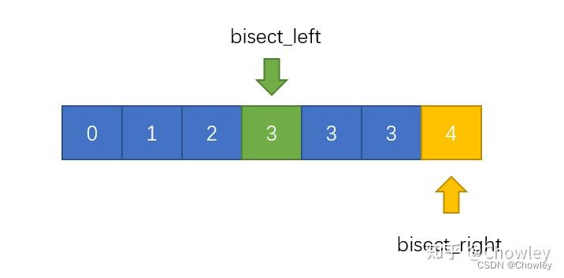

## 二分法（Binary Search）

易错点：

- r 是取n还是n-1

- 循环条件 l <= r  还是 l  < r

- 左右指针的移动 ，取m、m+1或m-1

左闭右开[ l , r ), 因为不取所以r取n

```python
def bisnary_search(arr,target):
    # 假设区间为左闭右开 [ l , r )
    l = 0
    r = len(arr)
    # 为保证区间内整数不为空，左闭右开[ l , r ) -> l!=r -> l<r
    while l < r:
        m = l + (r-l)//2        # 虽然pyhton不会int溢出，但是为了规范，要写。相当于 左+ 差值的一半
        if target <= arr[m]:
            r = m               # 右开，取m;注意不能取m-1或m+1.m-1会导致失去取这个值的可能。m+1可能会导致死循环，即刚好m-1 = l；m+1 = r时，会死循环
        elif arr[m] < target:
            l = m+1             # 左开，arr[m]被排除，取m+1
    # 循环结束的条件 l=r，此时arr[m] < target < arr[l]
    # 返回第一个大于等于target的位置,使用l、r都可以，
    # 但语义为target的值在左侧 target <= arr[ r , len )
    return l
```


### 内置函数bisec（只适用与升序）
易错点：
1 low high 参数不能相等，不然会被判定为空列表；实际上 high = low + len(a),即**左闭右开**

bisect_left
      ^
0 1 2 3 3 3 4
            ^
        bisect_right

a = arr ; target = x
1. bisect_left 函数源码及解析
```python
def bisect_left(a, x, lo=0, hi=None):
    if lo < 0:
        raise ValueError('lo must be non-negative')
    if hi is None:
        hi = len(a)
    while lo < hi:
        mid = (lo + hi) // 2
        if a[mid] < x:          # 区别在于这里
            lo = mid + 1
        else:               # a[mid] >= x
            hi = mid
    return lo
```
功能：在已排序序列 a 中查找元素 x 应该插入的位置，并返回最左侧的插入位置。
区别：如果有多个相同元素，bisect_left 返回最左侧的插入位置。

2. bisect_right 函数源码及解析
```python
def bisect_right(a, x, lo=0, hi=None):
    if lo < 0:
        raise ValueError('lo must be non-negative')
    if hi is None:
        hi = len(a)
    while lo < hi:
        mid = (lo + hi) // 2
        if x < a[mid]:
            hi = mid
        else:                   # a[mid] <= x
            lo = mid + 1
    return lo
```
功能：在已排序序列 a 中查找元素 x 应该插入的位置，并返回最右侧的插入位置。
区别：如果有多个相同元素，bisect_right 返回最右侧的插入位置。


```python
# 上述方法，在while循环到最后面，都会出现以下情况：
lo = mid
hi = mid +1
# 而不等式的设置不同会产生不同的效果
# 最后一个循环，lo最终等于mid +1
left:   mid < x     # 最后的情况 mid < x <= mid +1, 有 a[lo-1] < x <= a[lo]
right:  mid <= x    # 最后的情况 mid <= x < mid +1，有 a[lo-1] <= x <a[lo]

# 如果有序序列中没有x目标值，则有 a[lo-1] < x < a[lo]
# 则上述两种方法的效果是一样的，即返回应该插入的位置，原位置以及后面的位置往后面移动

```
