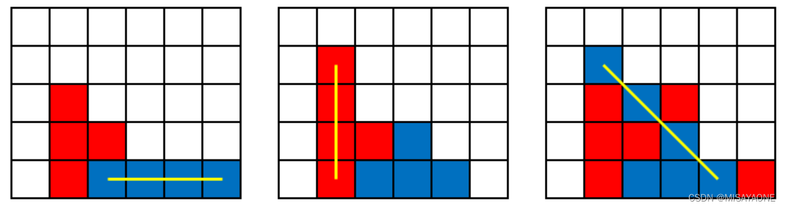
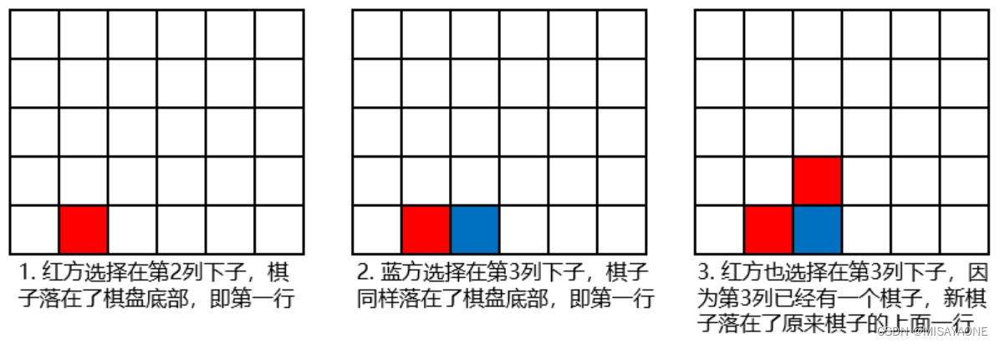

## 天然蓄水池
公元2919年，人类终于发现了一颗宜居星球——X星。
现想在X星一片连绵起伏的山脉间建一个天热蓄水库，如何选取水库边界，使蓄水量最大？

要求：

        山脉用正整数数组s表示，每个元素代表山脉的高度。
        选取山脉上两个点作为蓄水库的边界，则边界内的区域可以蓄水，蓄水量需排除山脉占用的空间
        蓄水量的高度为两边界的最小值。
        如果出现多个满足条件的边界，应选取距离最近的一组边界。
输出边界下标（从0开始）和最大蓄水量；如果无法蓄水，则返回0，此时不返回边界。
例如，当山脉为s=[3,1,2]时，则选取s[0]和s[2]作为水库边界，则蓄水量为1，此时输出：0 2:1
当山脉s=[3,2,1]时，不存在合理的边界，此时输出：0。

给定一个长度为 n 的整数数组 height 。数组的元素表示山的高度，选择两个元素作为水库的边界，求蓄水量的最大值并输出蓄水量最大时的边界下标（蓄水量相同时输出下标较近的）。

输入描述：

输入一行数字，空格分隔。

输出描述：

输出蓄水量的最大值及输出蓄水量最大时的边界下标

示例1：

输入：

1 8 6 2 5 4 8 3 7 

输出：

1 6:15

说明：蓄水量的最大值为 15

蓄水量最大时的边界下标为1 和 6

### 答案

```python
high = [int(i) for i in input().split()]

n = len(high)
hi = n-1
lo = 0

S_max = 0
index = [lo,hi]
while lo < hi -1:
    min_bian = min(high[lo],high[hi])
    S = min_bian*(hi-lo-1)
    # 剪枝
    if S < S_max:
        if high[lo] > high[hi]:
            hi -= 1
        else:
            lo += 1
        continue

        
    for i in range(lo+1,hi):
        if high[i] >= min_bian:
            S -= min_bian
        else:
            S -= high[i]
    if S >= S_max:
        S_max = S
        index = [lo,hi]
    
    if high[lo] > high[hi]:
        hi -= 1
    else:
        lo += 1


if S_max == 0:
    print(0)
else:
    print(" ".join(map(str,index)),end=":")
    print(S_max)
```


## 采购订单
在一个采购系统中，采购申请(PR)需要经过审批后才能生成采购订单(PO)。每个PR包含商品的单价(假设相同商品的单价一定是一样的)及数量信息。系统要求对商品进行分类处理:单价高于100元的商品需要单独处理，单价低于或等于100元的相同商品可以合并到同一采购订单PO中。针对单价低于100的小额订单，如果量大可以打折购买。
具体规则如下:
如果PR状态为"审批通过"，则将其商品加入到PO中。如果PR的状态为"审批拒绝"或"待审批"，则忽略改PR,对于单价高于100元的商品、每个商品单独生成一条PO记录。对于单价低于100元的商品，将相同商品的数量合并四到一条PO记录中。如果商品单价<100且商品数量>=100，则单价打9折。
输入描述
第一行包含整数N，表示PR的数量。
接下来N行，每行包含四个用空格分割的整数，按顺序表示:商品ID,数量，单价，PR状态(0表示审批通过，1表示审批拒绝，2表示待审批)
输出描述
输出若干行，每行表示一条PO记录，按以下格式输出:
对于单价高于100元的商品:商品ID 数量 单价
对于单价低于或等于100元的商品:商品ID 总数量 打折后的单价(向上取整)输出的PO记录按商品ID升序升序排列，相同商品按照数量降序排列
补充
2<=n<= 1000
1<= 商品价格 <= 200
1 <= 商品数量 <= 1000
2<= 商品编号 <= 1000

示例1：

输入

2
1 200 90 0
2 30 101 0
 

输出

1 200 81
2 30 101
 

说明：

商品1的原始单价为90，审批通过，生成一条PO，满足打折条件，打折后单价为81。商品2的单价为101，审批通过，生成一条PO

示例2：

输入

3
1 10 90 0
1 5 90 0
2 8 120 0
 

输出

1 15 90
2 8 120
 

说明：

PR1和PR2均为商品1，单价90，审批通过，单价低于100元，合并数量为150.PR3为商品2，单价120元，审批通过，单价高于100元，单独生成一条PO记录

示例3：

输入

4
1 5 80 0
2 3 120 0
3 2 90 1
4 10 150 2
 

输出

1 5 80
2 3 120
 

说明：

PR1:商品1，单价80元，审批通过，单价低于100元，合并到PO中。

PR2:商品2，单价120元，审批通过，单价高于100元，单独生成一条PO记录。PR3:审批拒绝，忽略。PR4待审批忽略。

## P00308. 出差 / 员工派遣
某公司部门需要派遣员工去国外做项目。
现在，代号为 x 的国家和代号为 y 的国家分别需要 cntx 名和 cnty 名员工部门每个员工有一个员工号 (1,2,3,......)，工号连续，从 1开始。部长派遣员工的规则:
规则1: 从 1,k中选择员工派遣出去
规则2: 编号为 x的倍数的员工不能去 x国，编号为 y 的倍数的员工不能去y 国
问题
找到最小的k，使得可以将编号在 [1,k] 中的员工分配给 x 国和 y 国，且满足 x 国和 y 国的需求

输入描述
四个整数 x,y,cntx,cnty。
2 < x < y < 30000
x和y 一定是质数
1 < cntx, cnty < 10^9
 cntx + cnty < 10^9
输出描述
满足条件的最小的 k

示例1：

输入：

2 3 3 1

输出：

5

说明:

输入中：
2 表示国家代号 2
3 表示国家代号 3
3 表示国家 2 需要3 个人

1 表示国家 3 需要1个人

输出的5表示k最小为5


### 思路
存在三种情况：
只能去其中一个国家；
两个国家都不能去；
两个国家都可以去

由于是质数，可以直接计算而不用一个一个遍历
x//k,y//k; y//(x*y) ; k - (前面的总和) （容斥原理）

优化：
由于是x，y<30000; 可以设置一个k=1000，000，000；再用二分法去做
或者
k=2 每次扩大一倍的方式，找到某个Kmax；在 [Kmax/2,Kmax]区间通过二分法查找

```python
x,y,cntx,cnty = map(int,input().split())

k = 1
cur_z =0
# 通用型人员 = 剩余的需求数量时退出循环
while cur_z < cntx + cnty:
    flag_x = 0
    flag_y = 0
    if k % x:
        flag_x = 1
    if k % y:
        flag_y = 1
    # 如果两个国家都可以去cur_z+1
    if flag_x and flag_y:
        cur_z += 1
    else:
        # 只能分配给某个国家，则对应的需求数-1
        # 同时需求书必须大于0
        if flag_x == 1 and cntx>0:
            cntx -= 1
        if flag_y == 1 and cnty >0:
            cnty -= 1
            
    k += 1

print(k-1)
```
## P00007. 华为od机试—小明减肥
小明有n个可选运动，每个运动有对应卡路里，想选出其中k个运动且卡路里和为t。k，t，n都是给定的。求出可行解数量
输入描述
第一行输入n t k
第二行输入 每个运动的卡路里 按照空格进行分割
备注
0<n<10
t>0，0<k<=n
每个运动量的卡路里>0
输出描述
求出可行解数量

示例1：

输入

4 3 2
1 1 2 3

输出

2

说明
可行解为2，选取{0,2},{1,2}两种方式。
### 思路
经典的组合选择问题,在n个元素中选择k个元素.
遍历方法:
对于每个元素有两种情况,选和不选;每个选择背后都要递归一次
结构:
模型时一个n深度的二叉树
优化:
对于选择超过k个元素和k个元素不符合某种条件时(根据题意),剪枝
终止条件别忘了:深度小于等于n

```python
import sys

with open("test.txt", "r", encoding="utf-8") as f:
    sys.stdin = f
    n, t, k = [int(i) for i in input().split()]
    krl = [int(i) for i in input().split()]

# 求k个和为t的组合


# 对于每个数有选和不选的策略
def solution(n, t, k, krl, index, pre_sum, pre_quantity, result, ans):
    # 对于当前的数
    if index > n - 1:
        return
    # 不选择
    solution(n, t, k, krl, index + 1, pre_sum, pre_quantity, result, ans)

    # 选择
    cur_sum = pre_sum + krl[index]
    cur_quantity = pre_quantity + 1
    if cur_sum > t:
        return
    if cur_quantity > k:
        return
    if cur_quantity == k and cur_sum == t:
        ans.append(result + [index])
        return
    else:
        solution(n, t, k, krl, index + 1, cur_sum, cur_quantity, result + [index], ans)
    return


ans = []
result = []
pre_sum = 0
pre_quantity = 0
solution(n, t, k, krl, 0, 0, 0, result, ans)
print(len(ans))

```

## #P00152. 华为od机试—查找接口成功率最优时间段
服务之间交换的接口成功率作为服务调用关键质量特性，某个时间段内的接口失败率使用一个数组表示，

数组中每个元素都是单位时间内失败率数值，数组中的数值为0~100的整数，

给定一个数值(minAverageLost)表示某个时间段内平均失败率容忍值，即平均失败率小于等于minAverageLost，

找出数组中最长时间段，如果未找到则直接返回NULL。

输入描述

输入有两行内容，第一行为{minAverageLost}，第二行为{数组}，数组元素通过空格(” “)分隔，

minAverageLost及数组中元素取值范围为0~100的整数，数组元素的个数不会超过100个。

输出描述

找出平均值小于等于minAverageLost的最长时间段，输出数组下标对，格式{beginIndex}-{endIndx}(下标从0开始)，

如果同时存在多个最长时间段，则输出多个下标对且下标对之间使用空格(” “)拼接，多个下标对按下标从小到大排序。

示例1 输入输出示例仅供调试，后台判题数据一般不包含示例

输入

1
0 1 2 3 4

输出

0-2

说明

输入解释：minAverageLost=1，数组[0, 1, 2, 3, 4]

前3个元素的平均值为1，因此数组第一个至第三个数组下标，即0-2

### 思路
直接暴力两层遍历
注意读题，没有要返回NULL

```python
import sys

# with open("test.txt", "r", encoding="utf-8") as f:
#     sys.stdin = f
#     n, t, k = [int(i) for i in input().split()]
#     krl = [int(i) for i in input().split()]

min_ave = int(input())
arr = list(map(int,input().split()))

S = [0] * (len(arr)+1)
for i in range(1,len(S)):
    S[i] = S[i-1] + arr[i-1]

max_len = 0
ans = []
for i in range(len(arr)-1):
    for j in range(i+1,len(arr)):
        cur_sum = S[j+1] - S[i]
        cur_len = j-i+1
        cur_ave = cur_sum/(cur_len)
        if cur_ave > min_ave:
            continue
        if max_len < cur_len:
            max_len = cur_len
            ans = [f'{i}-{j}']
        elif max_len == cur_len:
            ans.append(f'{i}-{j}')

if ans:
    print(" ".join(ans))
else:
    print("NULL")
```
## P00237. 华为od机试—竖直四子棋


竖直四子棋的棋盘是竖立起来的，双方轮流选择棋盘的一列下子，棋子因重力落到棋盘底部或者其他棋子之上，当一列的棋子放满时，无法再在这列上下子。
一方的4个棋子横、竖或者斜方向连成一线时获胜。
现给定一个棋盘和红蓝对弈双方的下子步骤，判断红方或蓝方是否在某一步获胜。
下面以一个6×5的棋盘图示说明落子过程：


下面给出横、竖和斜方向四子连线的图示：


输入描述
输入为2行，第一行指定棋盘的宽和高，为空格分隔的两个数字；
第二行依次间隔指定红蓝双方的落子步骤，第1步为红方的落子，第2步为蓝方的落子，第3步为红方的落子，以此类推。
步骤由空格分隔的一组数字表示，每个数字为落子的列的编号（最左边的列编号为1，往右递增）。用例保证数字均为32位有符号数。
输出描述
如果落子过程中红方获胜，输出 N,red ；
如果落子过程中蓝方获胜，输出 N,blue ；
如果出现非法的落子步骤，输出 N,error。
N为落子步骤的序号，从1开始。如果双方都没有获胜，输出 0,draw 。
非法落子步骤有两种，一是列的编号超过棋盘范围，二是在一个已经落满子的列上落子。
N和单词red、blue、draw、error之间是英文逗号连接。
示例1 输入输出示例仅供调试，后台判题数据一般不包含示例
输入
5 5
1 1 2 2 3 3 4 4
输出
7,red
说明
在第7步，红方在第4列落下一子后，红方的四个子在第一行连成一线，故红方获胜，输出 7,red。
示例2 输入输出示例仅供调试，后台判题数据一般不包含示例
输入
5 5
0 1 2 2 3 3 4 4
输出
1,error
说明
第1步的列序号为0，超出有效列编号的范围，故输出 1,error。